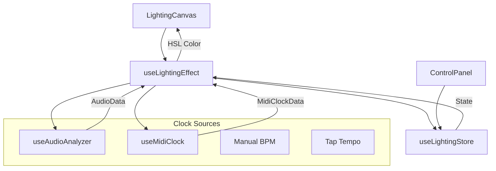

<div align="center">

# Lightbox

**Transform your TV into a professional DJ lighting controller**

[](https://nextjs.org/)
[](https://www.typescriptlang.org/)
[](https://tailwindcss.com/)
[](https://zustand-demo.pmnd.rs/)
[](LICENSE)

A real-time lighting control application designed for DJ set recordings. Features beat-synced effects, MIDI clock integration, audio-reactive spectrum mode, and multiple shape modes.

[Features](#features) · [Quick Start](#quick-start) · [Usage](#usage) · [Clock System](#clock-system) · [Architecture](#architecture)

</div>

---

## Features

| Feature | Description |
|---------|-------------|
| **Beat Sync** | Automatic beat detection from audio input with kick onset detection |
| **MIDI Clock** | Direct integration with Traktor, Ableton, or any DAW via Web MIDI API |
| **Spectrum Mode** | Audio-reactive colors that follow bass/mid/treble frequencies |
| **Ring Light** | Simulated ring light mode with adjustable size and thickness |
| **5 Effects** | Static, Solid, Pulse, Breathe, and Strobe with clock synchronization |
| **DJ Presets** | 13 color presets accessible via keyboard (1-9 keys) |
| **Persistent Settings** | All preferences saved to localStorage automatically |

---

## Quick Start

### Prerequisites

- Node.js 18+
- npm, yarn, or pnpm
- Chrome/Edge browser (required for MIDI support)

### Installation

```bash
# Clone the repository
git clone https://github.com/yourusername/lightbox.git
cd lightbox

# Install dependencies
npm install

# Start development server
npm run dev
```

Open [http://localhost:3000](http://localhost:3000) in your browser.

### Build for Production

```bash
npm run build
npm run start
```

---

## Usage

### Keyboard Shortcuts

| Key | Action |
|-----|--------|
| `F` | Toggle fullscreen |
| `Escape` | Hide control panel |
| `Space` / `Enter` | Toggle control panel |
| `1` | White |
| `2` | Warm White |
| `3` | Hot Pink |
| `4` | Electric Blue |
| `5` | Deep Purple |
| `6` | Neon Green |
| `7` | Cyan |
| `8` | Amber |
| `9` | Red |

### Control Panel

Click anywhere on the screen to toggle the control panel. The panel has four tabs:

#### Color Tab
- **Hue**: 0-360° color wheel
- **Saturation**: 0-100% color intensity
- **Brightness**: 0-100% overall light level
- **Presets**: Quick-select DJ color palette
- **Spectrum Mode**: Auto-color based on audio frequencies (requires Audio clock)

#### Shape Tab
- **Softbox**: Full-screen solid color (default)
- **Ring**: Circular ring light simulation
  - Size: 10-90% of screen
  - Thickness: 5-50% of ring diameter

#### Effects Tab
- **Effect Selector**: Choose from 5 effect types
- **Speed**: Animation speed multiplier (disabled when clock-synced)
- **Intensity**: Effect strength/amplitude

#### Clock Tab
- **Source**: Off, Audio, Manual, Tap, or MIDI
- **BPM Display**: Current tempo
- **Audio Settings**: Sensitivity, smoothing, beat/volume mode
- **MIDI Settings**: Device selector

---

## Clock System

The clock system provides unified BPM control for synchronizing effects to music.

### Clock Sources

| Source | Description | Best For |
|--------|-------------|----------|
| **Off** | No synchronization, effects run freely | Ambient lighting |
| **Audio** | Beat detection from microphone input | Live DJ sets |
| **Manual** | Manual BPM entry (40-300) | Offline testing |
| **Tap** | Tap tempo (4-8 taps to set BPM) | Quick sync without audio |
| **MIDI** | MIDI clock from DAW/Traktor | Professional setups |

### MIDI Setup (Traktor Pro 4)

#### Step 1: Install Virtual MIDI Port

Download and install [loopMIDI](https://www.tobias-erichsen.de/software/loopmidi.html) on Windows.

Create a new virtual port named `Lightbox Clock`.

#### Step 2: Configure Traktor

**Add Generic MIDI Device:**
1. Go to **Preferences** → **Controller Manager**
2. Click **Add...** → Select **Generic MIDI**
3. Set **Out-Port** to your loopMIDI port
4. Set **In-Port** to **None** (prevents MIDI loops)

**Enable MIDI Clock:**
1. Go to **Preferences** → **MIDI Clock**
2. Enable **Send MIDI Clock**
3. (Optional) Adjust **MIDI Clock Sending Offset** if timing feels off

**Start Sending:**
1. Go to **Preferences** → **Global Settings**
2. Enable **Show Global Section**
3. In Traktor's top bar, click the **SEND** play button

#### Step 3: Connect in Lightbox

1. Set Clock Source to **MIDI**
2. Click the refresh button to scan for devices
3. Select your loopMIDI port from the dropdown
4. Play music in Traktor - Lightbox will sync automatically

*Reference: [Native Instruments MIDI Clock Guide](https://support.native-instruments.com/hc/en-us/articles/209590629-How-to-Send-a-MIDI-Clock-Sync-Signal-in-TRAKTOR)*

### Audio Beat Detection

The audio analyzer uses onset detection to identify kick drums:

| Parameter | Value |
|-----------|-------|
| FFT Size | 512 bins |
| Bass Range | 0-8% of spectrum (~0-350Hz) |
| Detection | Onset threshold with adaptive sensitivity |
| Debounce | 100ms minimum between beats |
| BPM Range | 40-600 BPM supported |

**Audio Modes:**

| Mode | Behavior |
|------|----------|
| **Beat** | Flash on kick detection, exponential decay between beats |
| **Volume** | Brightness follows overall audio level |

---

## Effects Reference

| Effect | Icon | Clock Off | Clock On |
|--------|------|-----------|----------|
| **Static** | ■ | Constant color | Constant color (ignores clock) |
| **Solid** | ● | Constant color | Flash + decay on beat |
| **Pulse** | ◐ | Sine wave oscillation | Synced to beat cycle |
| **Breathe** | ◯ | Slow eased oscillation | Synced with smoothstep easing |
| **Strobe** | ⚡ | Fast on/off flash | Flash on beat only |

### Clock Sync Behavior

When a clock source is active, the **Speed** slider is disabled for clock-synced effects (Solid, Pulse, Breathe, Strobe). The **Static** effect never syncs to clock.

### Effect Details

**Solid (Clock On)**
```
On beat: 100% brightness
Decay: e^(-t/80ms) exponential falloff
Minimum: 15% brightness between beats
```

**Pulse/Breathe**
```
Clock Off: Speed slider controls frequency
Clock On: One full cycle per beat
Intensity: Controls oscillation amplitude
```

**Strobe**
```
Clock Off: Duty cycle from intensity
Clock On: 50ms flash on each beat
```

---

## Color System

### Spectrum Mode

When clock source is set to **Audio**, enable Spectrum Mode to automatically color based on frequency content:

| Frequency Band | Hue Range | Colors |
|----------------|-----------|--------|
| Bass (0-350Hz) | 0° - 40° | Red → Orange |
| Mids (350Hz-5kHz) | 70° - 170° | Yellow → Green → Cyan |
| Treble (5kHz+) | 220° - 260° | Blue → Purple |

The dominant frequency band determines the base hue, with smooth blending when bands overlap.

### Color Presets

| Key | Name | HSL |
|-----|------|-----|
| 1 | White | (0, 0%, 100%) |
| 2 | Warm White | (40, 30%, 100%) |
| 3 | Hot Pink | (330, 100%, 50%) |
| 4 | Electric Blue | (220, 100%, 50%) |
| 5 | Deep Purple | (270, 100%, 50%) |
| 6 | Neon Green | (120, 100%, 50%) |
| 7 | Cyan | (180, 100%, 50%) |
| 8 | Amber | (35, 100%, 50%) |
| 9 | Red | (0, 100%, 50%) |

---

## Shape Modes

### Softbox (Default)

Full-screen solid color fill. Traditional background/fill lighting for video production.

### Ring

Circular ring light simulation with configurable parameters:

| Parameter | Range | Description |
|-----------|-------|-------------|
| **Size** | 10-90% | Ring diameter as percentage of screen |
| **Thickness** | 5-50% | Ring width as percentage of diameter |

Uses CSS radial gradient for smooth rendering. Black background with colored ring band.

---

## Architecture

### Project Structure

```
src/
├── app/
│   ├── layout.tsx          # Root layout, metadata
│   ├── page.tsx            # Main page, keyboard handlers
│   └── globals.css         # Global styles
├── components/
│   ├── LightingCanvas.tsx  # Full-screen display
│   ├── ControlPanel.tsx    # Floating control panel
│   ├── ColorControls.tsx   # Color tab UI
│   ├── ShapeControls.tsx   # Shape tab UI
│   ├── EffectControls.tsx  # Effects tab UI
│   ├── ClockControls.tsx   # Clock tab UI
│   └── ui/                 # shadcn/ui components
├── hooks/
│   ├── useLightingStore.ts  # Zustand state management
│   ├── useLightingEffect.ts # Animation loop
│   ├── useAudioAnalyzer.ts  # Beat detection
│   └── useMidiClock.ts      # MIDI integration
├── lib/
│   ├── colors.ts           # Color utilities, presets
│   ├── effects.ts          # Effect implementations
│   └── utils.ts            # Helper functions
└── types/
    └── index.ts            # TypeScript definitions
```

### Data Flow



### Key Hooks

#### `useLightingStore`

Zustand store with localStorage persistence. Manages all application state:

```typescript
interface LightingState {
  // Color
  hue: number;
  saturation: number;
  brightness: number;
  colorMode: 'manual' | 'spectrum';

  // Shape
  shape: 'softbox' | 'ring';
  ringSize: number;
  ringThickness: number;

  // Effect
  effect: EffectId;
  effectSpeed: number;
  effectIntensity: number;

  // Clock
  clockSource: ClockSource;
  manualBpm: number;
  midiDeviceId: string | null;

  // Audio
  audioMode: 'beat' | 'volume';
  audioSensitivity: number;
  audioSmoothing: number;
}
```

#### `useLightingEffect`

RAF-based animation loop running at 60 FPS. Computes final HSL color based on:
- Base color (hue, saturation)
- Active effect and its parameters
- Clock source and beat timing
- Brightness modifier

#### `useAudioAnalyzer`

Web Audio API integration providing:
- Real-time FFT frequency analysis
- Onset detection for beat tracking
- BPM estimation from kick intervals

#### `useMidiClock`

Web MIDI API integration providing:
- Device enumeration and selection
- MIDI clock pulse counting (24 PPQN)
- BPM calculation from pulse intervals

---

## Tech Stack

| Technology | Version | Purpose |
|------------|---------|---------|
| [Next.js](https://nextjs.org/) | 16.1 | React framework with App Router |
| [React](https://react.dev/) | 19.2 | UI library |
| [TypeScript](https://www.typescriptlang.org/) | 5 | Type safety |
| [Tailwind CSS](https://tailwindcss.com/) | 4 | Utility-first styling |
| [Zustand](https://zustand-demo.pmnd.rs/) | 5.0 | State management |
| [motion/react](https://motion.dev/) | 12.23 | Animations |
| [shadcn/ui](https://ui.shadcn.com/) | - | UI components |
| [Radix UI](https://www.radix-ui.com/) | - | Accessible primitives |
| [Lucide](https://lucide.dev/) | 0.562 | Icons |

---

## Browser Support

| Browser | Audio | MIDI | Notes |
|---------|-------|------|-------|
| Chrome 43+ | Yes | Yes | Full support |
| Edge 79+ | Yes | Yes | Full support |
| Firefox | Yes | No | No Web MIDI API |
| Safari | Yes | No | No Web MIDI API |

**Requirements:**
- HTTPS or localhost (required for Web MIDI)
- Microphone permission (for audio mode)

---

## Contributing

### Development Setup

1. Fork the repository
2. Create a feature branch: `git checkout -b feature/my-feature`
3. Make your changes
4. Run type check: `npx tsc --noEmit`
5. Commit: `git commit -m "Add my feature"`
6. Push: `git push origin feature/my-feature`
7. Open a Pull Request

### Code Style

- TypeScript strict mode enabled
- Functional components with hooks
- Zustand for global state
- Tailwind CSS for styling (prefer `stone` palette)

### Adding New Effects

1. Define the effect in `src/lib/effects.ts`:
```typescript
const myEffect: LightingEffect = {
  id: 'myEffect',
  name: 'My Effect',
  icon: '★',
  compute: (baseColor, time, settings) => {
    // Return modified HSL
    return { ...baseColor, l: 50 };
  },
};
```

2. Add the effect ID to `EffectId` type in `src/types/index.ts`

3. Add to `EFFECTS` object in `src/lib/effects.ts`

4. If clock-synced, add to `CLOCK_SYNCED_EFFECTS` in `EffectControls.tsx`

5. Add clock-synced behavior in `useLightingEffect.ts`

### Adding New Clock Sources

1. Add source to `ClockSource` type in `src/types/index.ts`
2. Create hook if needed (e.g., `useMidiClock.ts`)
3. Update `ClockControls.tsx` UI
4. Handle in `useLightingEffect.ts` animation loop

---

## Troubleshooting

### MIDI device not appearing

1. Ensure you're using Chrome or Edge
2. Check that the page is served over HTTPS or localhost
3. Click the refresh button to re-scan devices
4. Verify loopMIDI is running with active ports

### Audio not detecting beats

1. Grant microphone permission when prompted
2. Increase **Sensitivity** in Clock settings
3. Decrease **Smoothing** for faster response
4. Ensure audio source has clear kick drums

### Colors stuck on yellow/orange in Spectrum Mode

This was fixed in the latest version. The spectrum now uses dominant frequency detection instead of weighted averaging.

### MIDI not syncing after page refresh

Fixed in latest version. The MIDI hook now waits for device initialization before attempting connection.

---

## License

MIT License - see [LICENSE](LICENSE) for details.

---

## Acknowledgments

- Inspired by professional DJ lighting setups
- Built for the creator community
- [shadcn/ui](https://ui.shadcn.com/) for beautiful components
- [Radix UI](https://www.radix-ui.com/) for accessible primitives

---

<div align="center">

Made with love for DJs and content creators

[Report Bug](https://github.com/yourusername/lightbox/issues) · [Request Feature](https://github.com/yourusername/lightbox/issues)

</div>
